# 🐺 Lobo-guará Tech — Tecnologia com Rastro de Inovação e Sustentabilidade

---

## 📄 Descrição do Projeto e Objetivo

O projeto Lobo-guará Tech busca solucionar a dificuldade de engajamento ecológico ao transformar atitudes ecológicas em um ciclo contínuo de motivação. Indo ao encontro da junção entre as inovações incremental e disruptiva, a plataforma conecta mecanismos tecnológicos já existentes às lacunas presentes na sustentabilidade. Criamos, assim, um Sistema de Gamificação Sustentável integrado, desenvolvido para converter o impacto ambiental positivo dos usuários em recompensas tangíveis e reconhecimento por meio de rankings e desafios dinâmicos.
O objetivo deste trabalho é consolidar uma solução que coloque o usuário no centro da resolução de problemas ambientais. A proposta visa tornar a sustentabilidade não apenas uma escolha consciente, mas um hábito diário reforçado por incentivos reais. Dessa forma, a plataforma entrega uma ferramenta capaz de escalar o impacto ecológico de maneira ágil, transformando o compromisso com o planeta em uma experiência digital altamente recompensadora. 

---

## 🛠️ Tecnologias Utilizadas

Para a construção desta interface moderna, responsiva e fluida, foram utilizadas as seguintes tecnologias e ferramentas:

* **HTML5:** Estruturação semântica de todas as páginas da aplicação (`index.html`, `sobre.html` `solucao.html`, `integrantes.html`, `faq.html` e `contato.html`).
* **CSS3:** Estilização baseada em arquitetura de design escalável, fazendo uso de:
    * *Variáveis CSS (Custom Properties)* para controle estrito da paleta de cores (60-30-10).
    * *CSS Grid Layout & Flexbox* para alinhamento dinâmico e organização em cards.
    * *Media Queries* aplicadas cirurgicamente para total responsividade em smartphones e tablets.
* **JavaScript:** Manipulação dinâmica do DOM para o funcionamento interativo do sistema de **Accordion** na página de FAQ (perguntas frequentes), gerenciando estados de expansão de texto e controle de `max-height`. E para a página Contato, na verificação das informações passadas pelo formulário.

---

## 📂 Estrutura de Pastas do Projeto

Abaixo está representada a arquitetura limpa de diretórios do repositório, garantindo organização e fácil manutenção do código-fonte:

```text
front-end/
├── index.html               # Página Inicial (apresentação e informações)
├── pag/                
│    ├── sobre.html          # Página Institucional (contexto, Missão e Roadmap)
│    ├── solucao.html        # Página de continuação sobre o projeto (funcionalidade)
│    ├── faq.html            # Página de Dúvidas Frequentes (accordion interativo)
│    └── integrantes.html    # Página sobre os integrantes (nome, rm, Linkedin e GitHub)   
│    
├──README.md                 # Guia técnico e informativo (este arquivo)
│
├── css/
│   └── style.css            # Folha de estilo unificada (Global, Componentes e Responsividade)
│
├── js/
│   └── script.js            # Lógica comportamental em JavaScript (Interação do FAQ e contato)
│
└── img/                     # Acervo de mídias do ecossistema
    ├── contato.png          # Foto da página Contato
    ├── faq1.png             # Foto da página FAQ
    ├── faq2.png             # Foto da página FAQ
    ├── faq3.png             # Foto da página FAQ
    ├── faq4.png             # Foto da página FAQ
    ├── faq5.png             # Foto da página FAQ
    ├── Guara.png            # Logotipo oficial Lobo-guará Tech
    ├── index1.png           # Foto da página Index
    ├── index2.png           # Foto da página Index
    ├── integrantes1.png     # Foto da página Integrantes
    ├── integrantes2.png     # Foto da página Integrantes
    ├── Pic1.png             # Foto do integrante Lucas
    ├── Pic2.jpeg            # Foto do integrante Eduardo
    ├── Pic3.jpeg            # Foto da integrante Lucas Fortunato
    ├── Pic4.jpeg            # Foto da integrante Ana
    ├── sobre1.png           # Foto da página Sobre
    ├── sobre2.png           # Foto da página Sobre
    ├── sobre3.png           # Foto da página Sobre
    ├── sobre4.png           # Foto da página Sobre
    ├── solucao1.png         # Foto da página Solução
    ├── solucao2.png         # Foto da página Solução
    └── solucao3.png         # Foto da página Solução
```
---

## 👥 Autores e Créditos

O desenvolvimento deste projeto foi idealizado e executado pela equipe de estudantes de **Análise e Desenvolvimento de Sistemas (ADS)** da **FIAP** na **Turma 1TDSPI**:

* **Ana Carolina Orcelli Bautzer** — RM 570281
  *Turma: 1TDSPI* 👉 [LinkedIn](https://www.linkedin.com/in/ana-bautzer/) | 👉 [GitHub](https://github.com/anabautzer)

* **Eduardo Lima de Souza** — RM 570412
  *Turma: 1TDSPI* 👉 [LinkedIn](https://www.linkedin.com/in/duduutech/) | 👉 [GitHub](https://github.com/duduutech)

* **Lucas Costa Serrano** — RM 571016
  *Turma: 1TDSPI* 👉 [LinkedIn](https://www.linkedin.com/in/lucas-costa-serrano-647327278/) | 👉 [GitHub](https://github.com/luckz4)

* **Lucas Fortunato Brandão de Pinho** — RM 572660
  *Turma: 1TDSPI* 👉 [LinkedIn](https://www.linkedin.com/in/lucas-fortunato-317643397/) | 👉 [GitHub](https://github.com/Loutcoun)

---

---

## 📸 Imagens e Representação do Projeto

Abaixo estão as representações visuais das telas que compõem a plataforma, demonstrando a consistência do design, o uso estratégico da paleta de cores institucional e a aplicação de técnicas avançadas de responsividade.

### 💻 1. Interface Desktop (Página Inicial - `index.html`)
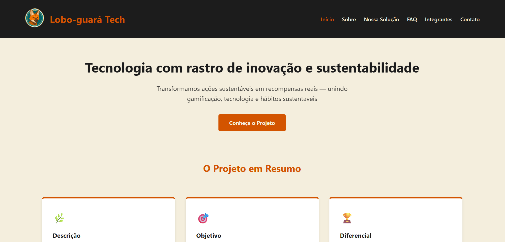
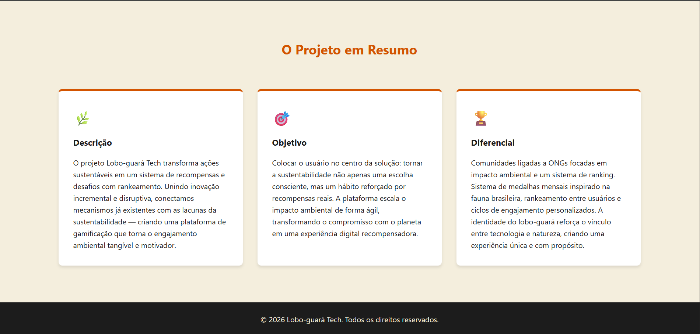
*Legenda: Seção principal projetada com contraste refinado, tipografia focada na legibilidade e foco na conversão imediata do usuário para conhecer o projeto.*

### 📄 2. Página Institucional (`sobre.html`)
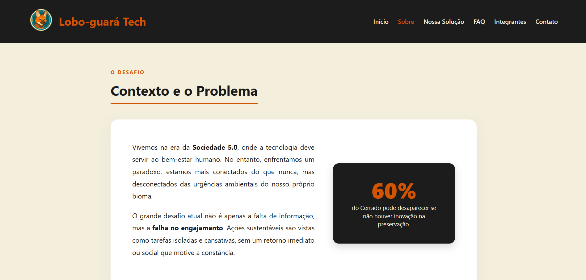
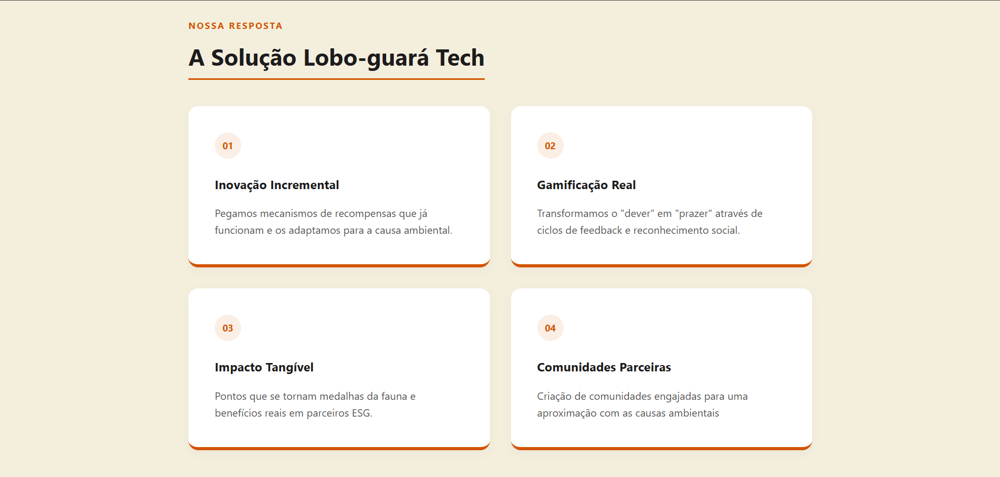  
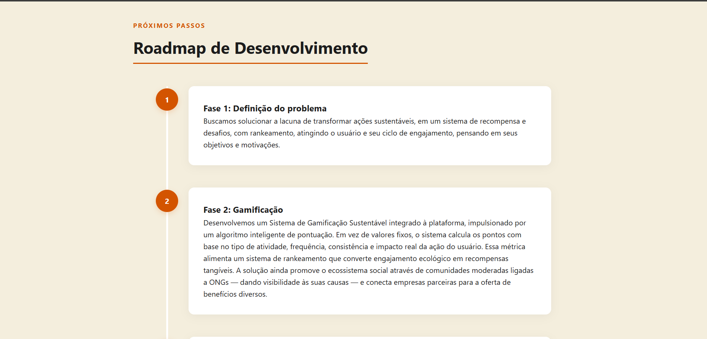  
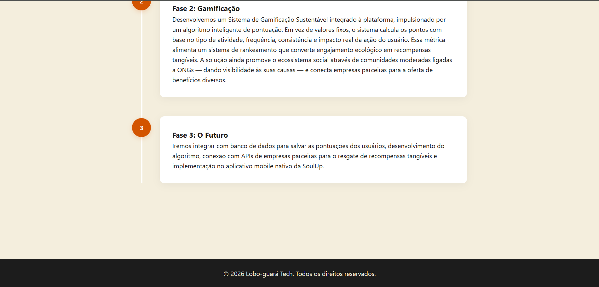     
*Legenda: Apresentação da missão, visão, valores do grupo e a conexão conceitual entre a Sociedade 5.0 e a preservação ambiental.*

### 🚀 3. Detalhamento da Funcionalidade (`solucao.html`)
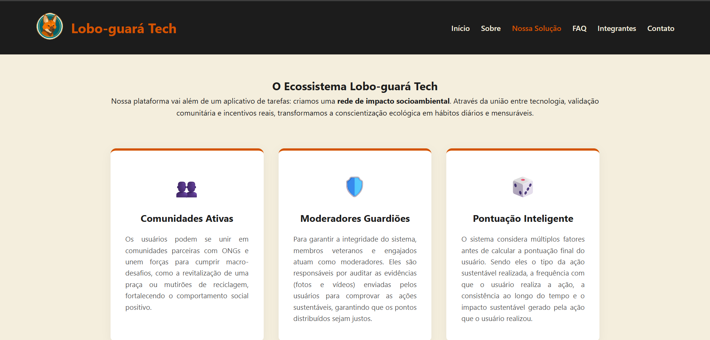
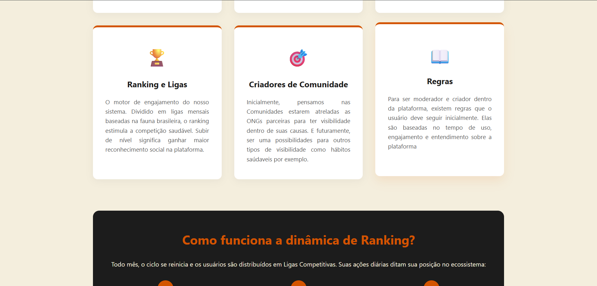  
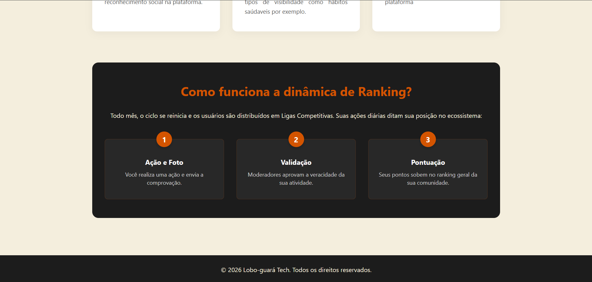    
*Legenda: Explicação detalhada do ecossistema de gamificação, regras e a dinâmica de pontuação.*

### 📱 4. Componente de FAQ Expandido (`faq.html`)
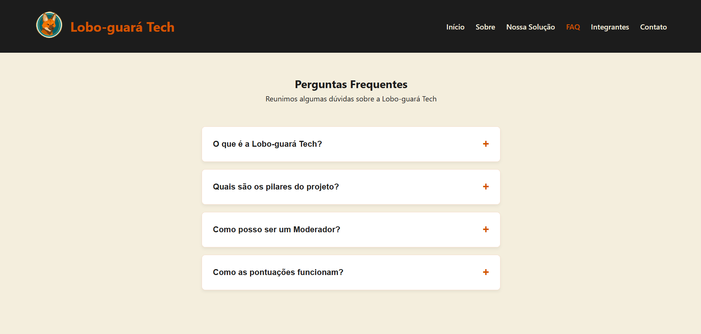
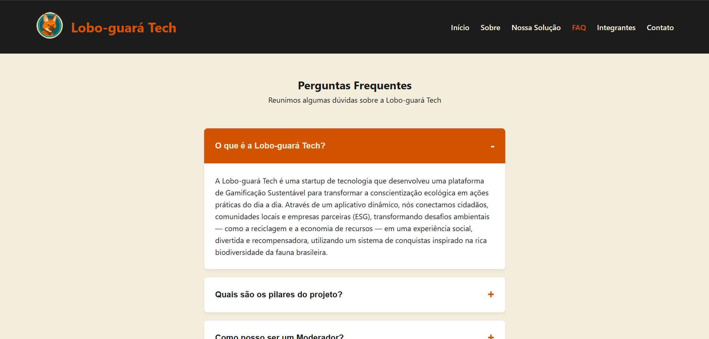  
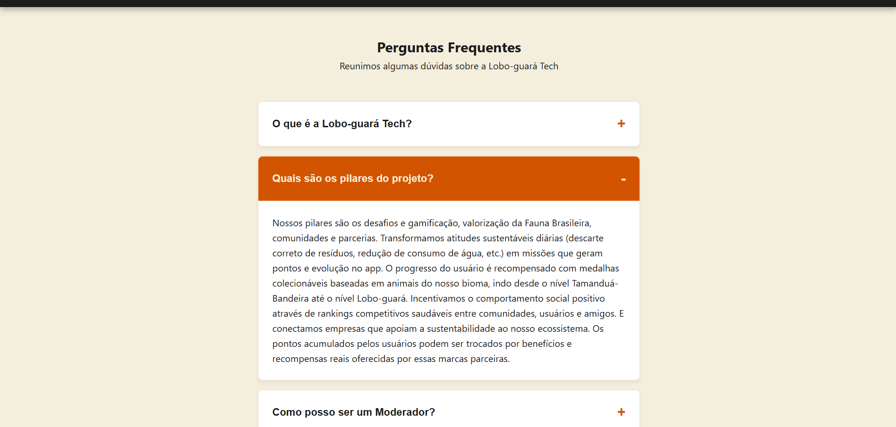  
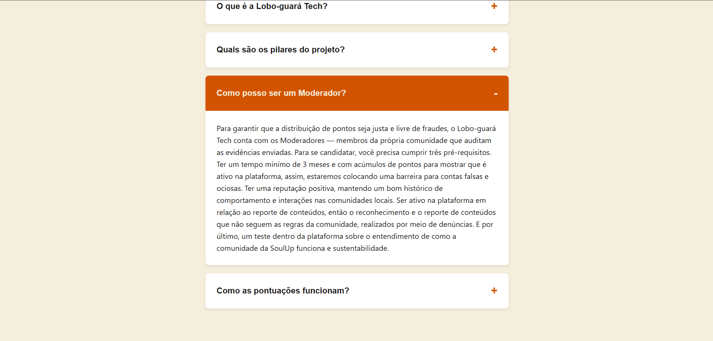  
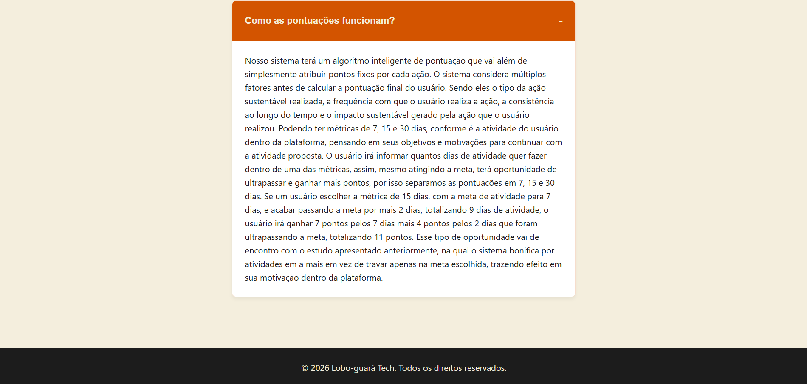    
*Legenda: Menu do tipo Accordion tratando quebras de linhas de forma fluida através de manipulação dinâmica do DOM em JavaScript.*

### 👥 5. Página do Time (`integrantes.html`)
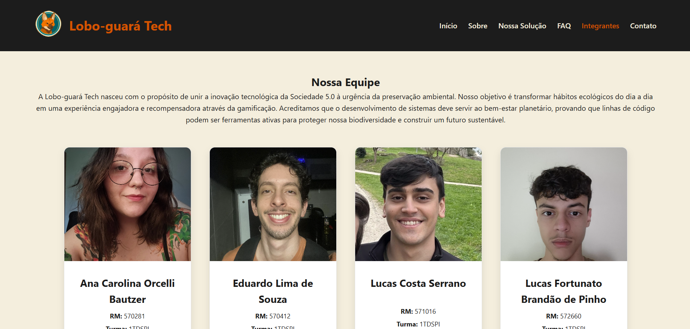  
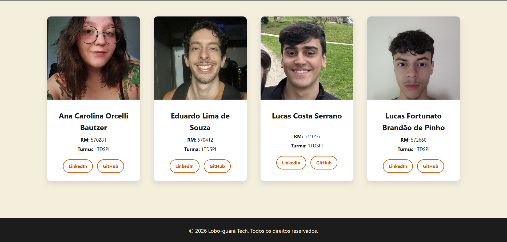  
*Legenda: Grid responsivo exibindo os cartões dos desenvolvedores com fotos customizadas e links integrados para redes profissionais.*

### ✉️ 6. Canal de Atendimento e Feedback (`contato.html`)
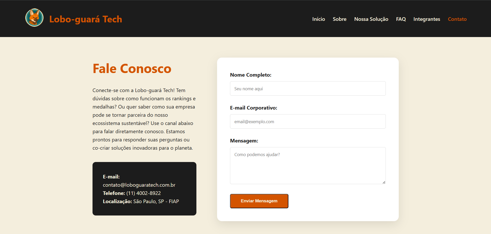  
*Legenda: Formulário estruturado com validação de campos para captação de mensagens de usuários e potenciais parceiros ESG.*

---

## 🔗 Link do Repositório

O código-fonte completo, histórico de evoluções e versionamento estruturado deste ecossistema web podem ser acessados publicamente no GitHub através do link oficial:

🚀 **[Acesse o Repositório Oficial no GitHub](https://github.com/Challenger-2026/front.git)**

---

## 📞 Contato e Suporte

Para esclarecimento de dúvidas técnicas sobre as mecânicas de gamificação, feedbacks sobre a arquitetura responsiva ou propostas de parcerias institucionais ESG, entre em contato através dos canais:

* **E-mail de Suporte:** contato@loboguaratech.com.br